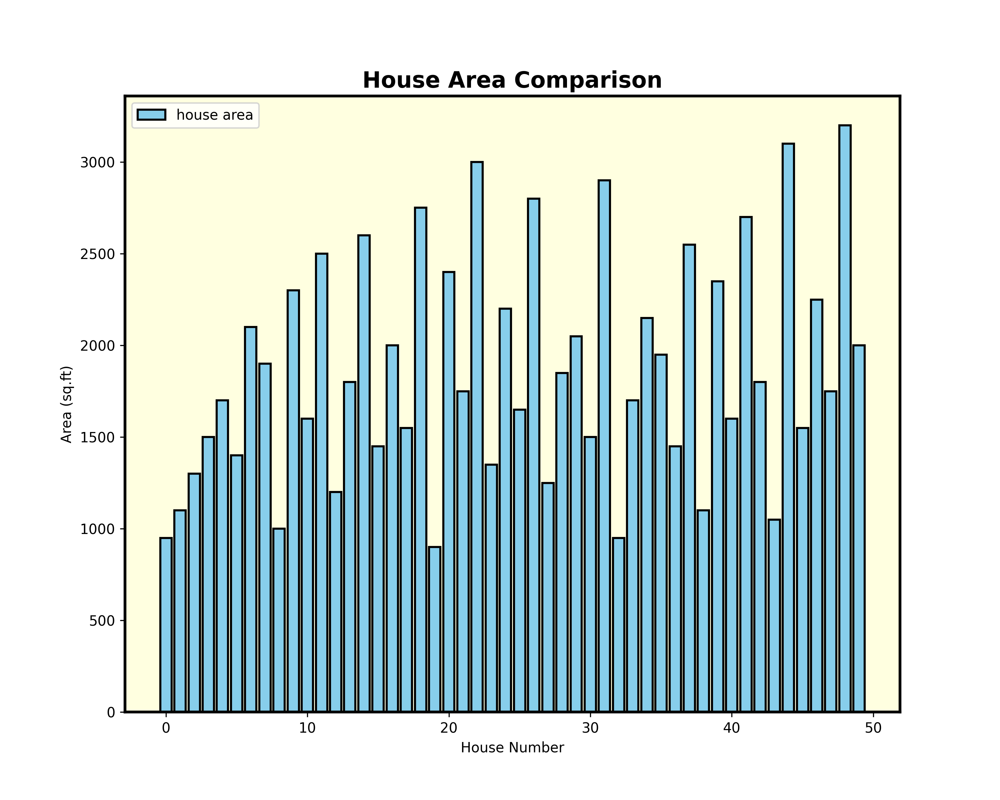
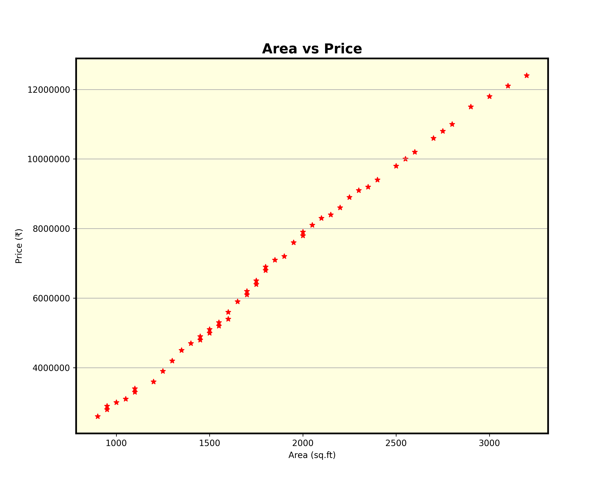
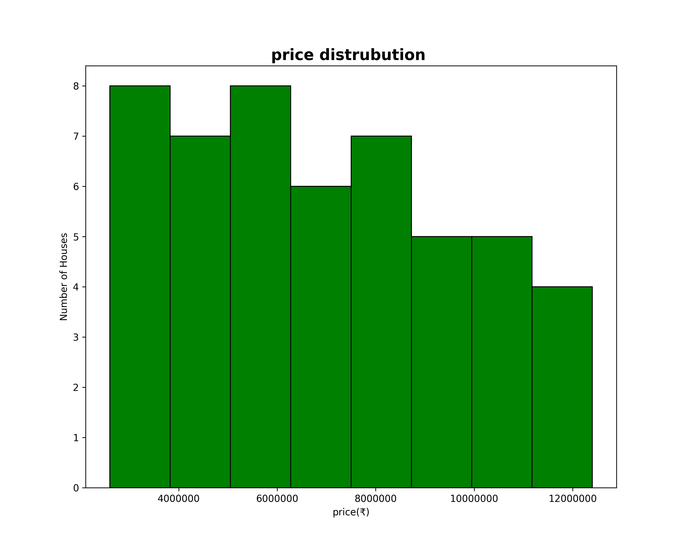
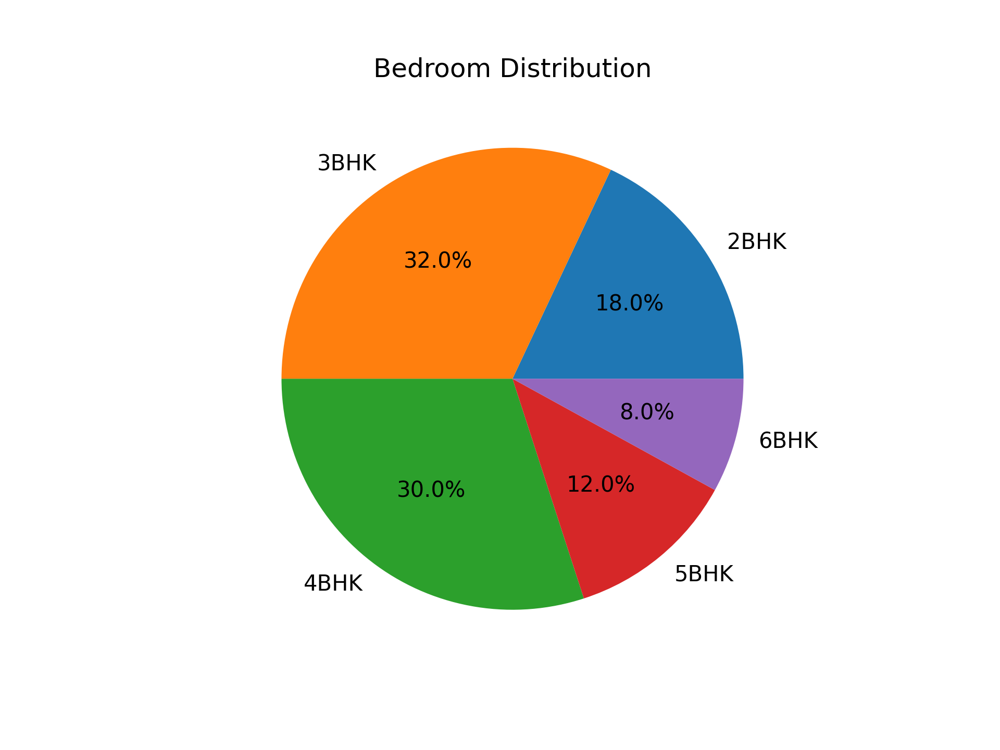

# 🏠 House Price Analysis Using NumPy & Matplotlib

## 📌 Project Overview

This project analyzes a house price dataset using **NumPy** for data processing and **Matplotlib** for visualization. The dataset contains information such as house area, bedrooms, bathrooms, age, and price.

The project demonstrates how NumPy can be used for data analysis without relying on Pandas.

---

## 🚀 Features

- Read CSV data using NumPy
- Indexing and Slicing
- Boolean Indexing
- Array Arithmetic
- Statistical Analysis
  - Mean
  - Maximum
  - Minimum
  - Sum
  - Argmax
  - Argmin
  - Sorting
- Data Visualization using Matplotlib
  - 📈 Line Chart
  - 📊 Bar Chart
  - 🔵 Scatter Plot
  - 📉 Histogram
  - 🥧 Pie Chart

---

## 🛠 Technologies Used

- Python
- NumPy
- Matplotlib

---

## 📂 Dataset

The dataset contains:

- Area (sq.ft)
- Bedrooms
- Bathrooms
- House Age
- House Price

---

## 📷 Output Graphs

## 📈 Line Chart


---

## 📊 Bar Chart



---

## 🔵 Scatter Plot



---

## 📉 Histogram



---

## 🥧 Pie Chart



---

## ▶️ How to Run

1. Install the required libraries:

```bash
pip install -r requirements.txt
```

2. Run the notebook:

```
House_Price_Analysis.ipynb
```

---

## 📈 Learning Outcomes

- CSV file handling using NumPy
- Data analysis using NumPy functions
- Data visualization with Matplotlib
- Statistical analysis of datasets
- Creating professional charts

---

## 👨‍💻 Author

**Harish Mayakuntla**

GitHub: https://github.com/HarishMayakuntla
LinkedIn: https://linkedin.com/in/harish-mayakuntla
